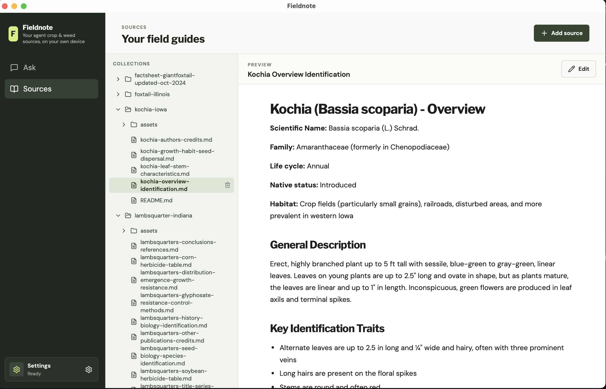
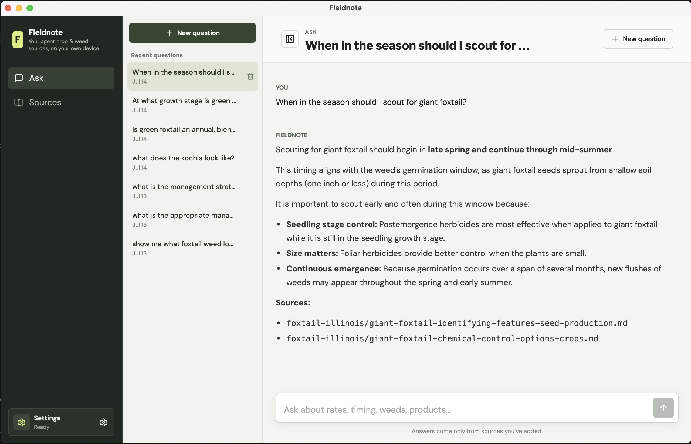

# Fieldnote

Fieldnote helps producers and crop advisors ask questions against **their own** compiled crop and weed management sources—herbicide guides, extension pubs, scouting notes, and related PDFs. Add documents to a local library, then ask in plain language; answers come only from what you’ve added.

This application was built to present at ASABE Hackathon at ASABE AIM 2026, Indianapolis.
<https://hackag.tech>

Team members: Aashish Poudel, Ben Shacklett, Utsab Bhandari, Blessing Ademola, Shaghayegh Janbazi Alamdari, Nidhi Rani

**Sources** — browse and preview the local field-guide library:



**Ask** — question those sources in plain language; answers cite the files used:



https://github.com/aashizpoudel/fieldnote/raw/master/docs/foxtail_chat.mp4

## Requirements

- Node.js 20+
- Rust (stable) and Cargo
- Tauri 2 system dependencies for your OS
- An OpenAI-compatible LLM API endpoint (URL, model name, and API key)

### Install Node.js

Download and install the LTS build from [nodejs.org](https://nodejs.org/), then confirm:

```bash
node -v   # v20+
npm -v
```

Restart your terminal after installing if the commands are not found.

### Install Rust

Install via [rustup](https://rustup.rs/):

**macOS / Linux:**

```bash
curl --proto '=https' --tlsv1.2 https://sh.rustup.rs -sSf | sh
```

**Windows:** download and run [rustup-init.exe](https://win.rustup.rs/).

Restart your terminal, then confirm:

```bash
rustc --version
cargo --version
```

### Install Tauri 2 system dependencies

Fieldnote is a Tauri 2 desktop app. Install the OS prerequisites below (see also the [official guide](https://v2.tauri.app/start/prerequisites/)).

**macOS** (desktop only — Xcode Command Line Tools is enough):

```bash
xcode-select --install
```

**Windows:**

1. Install [Microsoft C++ Build Tools](https://visualstudio.microsoft.com/visual-cpp-build-tools/) and select **Desktop development with C++**.
2. Install the [WebView2 Evergreen Runtime](https://developer.microsoft.com/en-us/microsoft-edge/webview2/) if it is not already present.

**Linux (Debian / Ubuntu):**

```bash
sudo apt update
sudo apt install libwebkit2gtk-4.1-dev \
  build-essential \
  curl \
  wget \
  file \
  libxdo-dev \
  libssl-dev \
  libayatana-appindicator3-dev \
  librsvg2-dev
```

For other distributions, follow the [Tauri Linux prerequisites](https://v2.tauri.app/start/prerequisites/#linux).

## Setup

```bash
cd app
npm install
```

Prompts live in `prompts/` at the repo root. Ingested sources are stored under `knowledge_base/` (created automatically; not committed).

## Run

Start the desktop app in development:

```bash
cd app
npm run tauri dev
```

On first launch, open **Settings**, set your model **Endpoint URL**, **Model**, and **API key**, then tap **Test**.

### Using LocalAI (local models)

[LocalAI](https://localai.io/) exposes an OpenAI-compatible API, so you can run models on your machine and point Fieldnote at it.

1. Install and start LocalAI (see the [LocalAI quickstart](https://localai.io/basics/getting_started/)). With Docker on CPU:

```bash
docker run -p 8080:8080 --name local-ai -ti localai/localai:latest-cpu
```

For NVIDIA GPUs, use an image such as `localai/localai:latest-gpu-nvidia-cuda-12` and pass `--gpus all`.

1. Open <http://localhost:8080>, go to **Models**, and install a chat model from the gallery (or install via CLI, e.g. `local-ai run llama-3.2-1b-instruct:q4_k_m`).
2. In Fieldnote **Settings**, use:

| Field            | Value                                                                           |
| ---------------- | ------------------------------------------------------------------------------- |
| **Endpoint URL** | `http://localhost:8080/v1`                                                      |
| **Model**        | Exact model id from LocalAI (e.g. `llama-3.2-1b-instruct:q4_k_m`)               |
| **API key**      | Any placeholder (e.g. `localai`) unless you set `LOCALAI_API_KEY` on the server |

1. Tap **Test**. When it succeeds, save settings and use **Sources** / **Ask** as usual.

Typical workflow:

1. **Sources** — add a PDF, Markdown, or text file; Fieldnote turns it into searchable notes.
2. **Ask** — question rates, timing, weeds, products, and related topics from those sources.

## Build

```bash
cd app
npm run tauri build
```

Bundled apps are written under `app/src-tauri/target/release/bundle/`.

## Acknowledgements

Fieldnote’s agent workflow is built with [`@earendil-works/pi-agent-core`](https://www.npmjs.com/package/@earendil-works/pi-agent-core), the JavaScript/TypeScript agent runtime from the [Pi](https://github.com/earendil-works/pi) toolkit.

## License

This project is licensed under the [MIT License](LICENSE).
